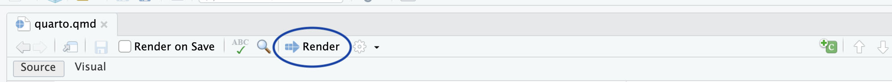
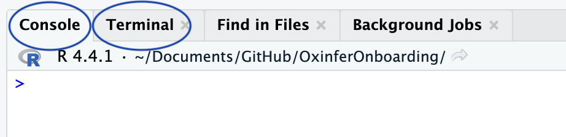
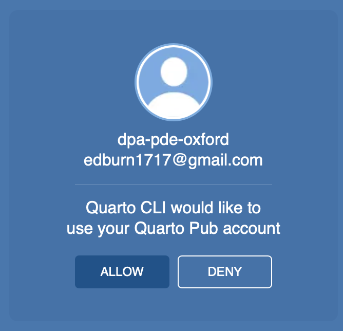

# Quarto

## Deploy quarto documents

If you want to learn more about how to publish using Quarto, the official documentation covering all deployment options can be found [here](https://quarto.org/docs/publishing/).

In this guide, we'll walk through the three main methods we use to deploy Quarto documents:
  
  * Deploy using **Quarto Pub**
  * Deploy using **GitHub Actions** with **GitHub Pages**

### Getting Started
  
Let’s begin by creating a simple project and an initial `test.qmd` document:

```markdown
---
title: "test"
editor: visual
format: html
---
  
## Subtitle 1
  
This is an example document

```

To render the document, you can either click the **Render** button:



Or use the *terminal*:
  
* `quarto render` — for static rendering
* `quarto preview` — for live-preview in a web browser

::: {.callout-note collapse="true"}
## Difference between terminal and console

### 🧮 **Console**

* **Purpose:** Runs **R code** interactively.
* **What it does:**

  * Executes R commands.
  * Shows outputs, errors, warnings, and messages from R.
  * Where your R scripts run by default.

### 💻 **Terminal**

* **Purpose:** Provides access to the system **shell** (e.g., Bash, Zsh, or Command Prompt).
* **What it does:**

  * Run system-level commands (`ls`, `git`, `python`, `quarto`, etc.).
  * Interact with Git, Quarto CLI, Python environments, makefiles, etc.
  * You can run R scripts using `Rscript`, but it’s not interactive like the Console.



:::

::: {.callout-note collapse="true"}
## Difference between `quarto render` and `quarto preview`

### 🛠 `quarto render`

* **Purpose:** Renders one or more `.qmd` files into the output format(s) (HTML, PDF, Word, etc.).
* **Use case:** When you want to **build** your final output files — for example, to publish or share.
* **Behavior:**

  * Runs the `.qmd` document(s).
  * Produces output files (like `.html`, `.pdf`, `.docx`, etc.) in the output directory.
  * **Does not start a web server** or open a browser window.

### 👀 `quarto preview`

* **Purpose:** Renders and **serves** the document (or website/book) in a local web browser, with **live-reloading**.
* **Use case:** When you are **developing** a document, website, or book and want to see changes live.
* **Behavior:**

  * Renders the file(s) like `render` does.
  * Starts a local **web server** (usually at `http://localhost:port`).
  * Watches files for changes and **automatically re-renders** and reloads the browser when you save.

### Summary

| Command          | Renders output? | Starts server? | Live reload? | Ideal for             |
| ---------------- | --------------- | -------------- | ------------ | --------------------- |
| `quarto render`  | ✅               | ❌              | ❌            | Final builds, scripts |
| `quarto preview` | ✅               | ✅              | ✅            | Development, writing  |

:::

### Deploying with **Quarto Pub**

To deploy your document with [Quarto Pub](https://quartopub.com):
  
1. **Create a Quarto Pub account**: Sign up [here](https://quartopub.com/sign-up).

> 💡 For team projects, use the group account. Credentials can be found [here](https://unioxfordnexus.sharepoint.com/:w:/r/sites/NDORMS-PDE/Shared%20Documents/OxInfer/Youtube%20channel/Credentials.docx?d=w73a09b646e9a4d7fa766feb3b3541722&csf=1&web=1&e=ledkLG).

2. Run the following in the terminal:
  
```bash
quarto publish quarto-pub
```

3. **Authorize your account**:
  


A browser window will open — sign in and click **Allow**:
  


4. Choose a name for your site (e.g., `test`).

Your document will be rendered and published to <https://username.quarto.pub/sitename/> (e.g., <https://dpa-dpe-oxford.quarto.pub/test/>)

🎉 Congratulations! You’ve published your first Quarto document! 🍾

> ✅ Good for quick sharing
> ❌ Not ideal for collaborative or large-scale projects — use GitHub Pages instead.

### Deploying with **GitHub Pages** and **GitHub Actions**
  
This method is ideal for collaborative and long-term projects.

#### Step 1: Set Up a GitHub Repository

* Push your project to GitHub.
* Make the repository **public** (unless you are paying for private runners).

#### Step 2: Enable GitHub Pages

You can do this via:
  
**Option A: R Console**
  
```r
usethis::use_github_pages()
```

**Option B: GitHub UI**
  
1. Create the `gh-pages` branch.
2. Go to **Settings → Pages**.
3. Under "Deploy from a branch", select `gh-pages`.

#### Step 3: Add a GitHub Actions Workflow
  
Create a file at `.github/workflows/publish.yml` with:
  
```yaml
on:
  workflow_dispatch:
  push:
    branches: main
  pull_request:
    branches: main 

name: Quarto Publish

jobs:
  build-deploy:
    runs-on: ubuntu-latest
    steps:
      - name: Check out repository
        uses: actions/checkout@v2 
        
      - name: Set up Quarto
        uses: quarto-dev/quarto-actions/setup@v2
        
      - name: Render quarto website
        run: quarto render
        
      - name: Publish
        if: github.event_name != 'pull_request'
        uses: quarto-dev/quarto-actions/publish@v2
        with:
          target: gh-pages
          render: false
          publish_dir: ./_site
        env:
          GITHUB_TOKEN: ${{ secrets.GITHUB_TOKEN }}
```
  
#### Step 4: Including R Code
  
If your Quarto documents include R code:
  
1. Create a lock file with:
  
```r
renv::init()
```

2. Update your GitHub Action to install R and dependencies:
  
```yaml
- name: Install R
  uses: r-lib/actions/setup-r@v2

- name: Install R libraries with renv
  uses: r-lib/actions/setup-renv@v2
```

Your complete `publish.yml` should now look like:
  
```yaml
on:
  workflow_dispatch:
  push:
    branches: main
  pull_request:
    branches: main 

name: Quarto Publish

jobs:
  build-deploy:
    runs-on: ubuntu-latest
    steps:
      - name: Check out repository
        uses: actions/checkout@v2 
        
      - name: Set up Quarto
        uses: quarto-dev/quarto-actions/setup@v2
        
      - name: Install R
        uses: r-lib/actions/setup-r@v2

      - name: Install R libraries in renv
        uses: r-lib/actions/setup-renv@v2
        
      - name: Render quarto website
        run: quarto render
        
      - name: Publish
        if: github.event_name != 'pull_request'
        uses: quarto-dev/quarto-actions/publish@v2
        with:
          target: gh-pages
          render: false
          publish_dir: ./_site
        env:
          GITHUB_TOKEN: ${{ secrets.GITHUB_TOKEN }}
```

### Pros and Cons
  
| Method | Pros | Cons |
|--|----|----|
| **GitHub Pages** | ✅ Fully automated with GitHub Actions<br>✅ Great for collaborative projects | ❌ Source code (and potentially data) must be public      |
| **Quarto Pub**   | ✅ Simple, fast for one-off projects<br>✅ No need to push source data        | ❌ Manual rendering each time<br>❌ Not ideal for teamwork |
  
::: {.callout-note collapse="true"}
## Other deployment methods

Note we have covered a thiny part of the deployment options, you can read more about how to publish quartos [here](https://quarto.org/docs/publishing/).

In fact, you can publish in github pages from the terminal or publish to quarto pub using github actions. So there are way more possibilities that we have shown in this tutorial.
:::

### Quarto websites

In this tutorial we have only worked with a simple `.qmd` document but using exactly the same deployment procedure we can create a website (set of html). To do so you need to create the `_quarto.yml` to give an structure to your set of `.qmd` files. You can read how to create and customise your `_quarto.yml` file [here](https://quarto.org/docs/websites/#config-file).
